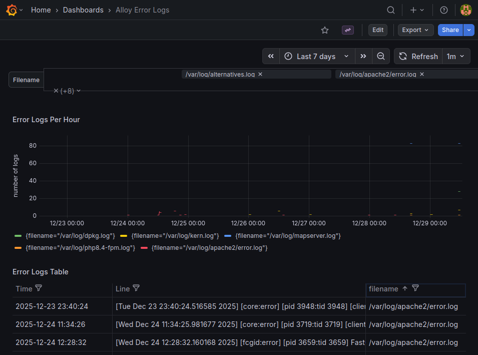
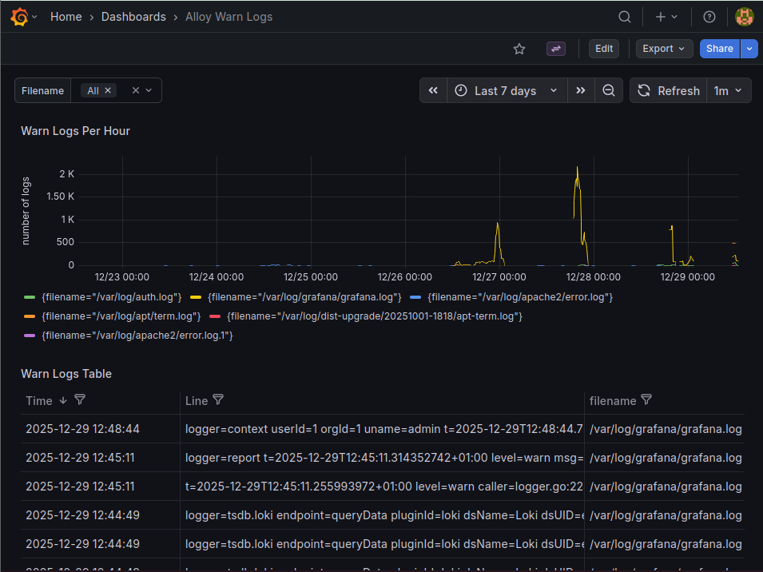

# Alloy Loki Logging Setup

## Projektübersicht

Dieses Repository enthält die Konfiguration für die Erfassung, Verarbeitung und Visualisierung von Logdaten mit **Alloy**, **Loki** und **Grafana**. Ziel ist es, Fehler- und Warnmeldungen in Echtzeit zu überwachen.

## Inhaltsverzeichnis

* [Alloy Konfiguration](#alloy-konfiguration)
* [Loki Integration](#loki-integration)
* [Grafana Dashboards](#grafana-dashboards)

  * [Error Logs Dashboard](#error-logs-dashboard)
  * [Warn Logs Dashboard](#warn-logs-dashboard)
* [Verwendung](#verwendung)

## Alloy Konfiguration

Die `config.alloy` definiert, wie Logdateien gelesen und an Loki weitergeleitet werden:

```hcl
local.file_match "local_files" {
  path_targets = [
    {"__path__" = "/var/log/**/*.log"},
  ]
}

loki.source.file "log_scrape" {
  targets       = local.file_match.local_files.targets
  tail_from_end = false
  forward_to    = [loki.process.process_logs.receiver]
}

loki.process "process_logs" {
  stage.labels {
    values = {
      filename = "__path__",
      host     = "__host__",
      source   = "file",
    }
  }
  forward_to = [loki.write.local_loki.receiver]
}

loki.write "local_loki" {
  endpoint {
    url = "http://localhost:3100/loki/api/v1/push"
    basic_auth {
      username = "admin"
      password = "admin"
    }
  }
}
```

## Loki Integration

Alloy sendet Logdaten an einen lokalen Loki-Server auf `http://localhost:3100`. Die Logs werden mit Labels versehen:

* `filename`: Pfad der Logdatei
* `host`: Hostname des Systems
* `source`: Quelle, hier `file`

## Grafana Dashboards

Es existieren zwei Dashboards zur Überwachung der Logs: Fehler und Warnungen.

### Error Logs Dashboard

**Dashboard UID:** `alloy-error-logs`

* **Error Logs Per Hour**: Zeigt die Anzahl der Fehler pro Stunde gruppiert nach Dateiname.
* **Error Logs Table**: Zeigt eine Tabelle aller Fehlerlogs mit Zeitstempel, Logzeile und Dateiname.

**Abfragebeispiel für Timeseries Panel:**

```loki
sum by (filename) (count_over_time({filename=~"$filename"} |= "error"[1h]))
```

### Warn Logs Dashboard

**Dashboard UID:** `alloy-warn-logs`

* **Warn Logs Per Hour**: Zeigt die Anzahl der Warnungen pro Stunde gruppiert nach Dateiname.
* **Warn Logs Table**: Zeigt eine Tabelle aller Warnlogs mit Zeitstempel, Logzeile und Dateiname.

**Abfragebeispiel für Timeseries Panel:**

```loki
sum by (filename) (count_over_time({filename=~"$filename"} |= "warn"[1h]))
```

## Verwendung

1. Stelle sicher, dass Loki und Grafana laufen.
2. Kopiere `config.alloy` auf den Zielhost.
3. Starte Alloy, um Logs zu sammeln und an Loki zu senden.
4. Öffne Grafana und importiere die Dashboards für Error- und Warnlogs.
5. Wähle die gewünschten Logdateien über die Template-Variable `$filename` aus.

---

## Beispiel-Logdateien

### Fehlerlogs



### Warnlogs



---

Dieses Setup ermöglicht eine zentrale Überwachung von Logdateien, schnelle Erkennung von Fehlern und Warnungen sowie eine übersichtliche Visualisierung in Grafana.
